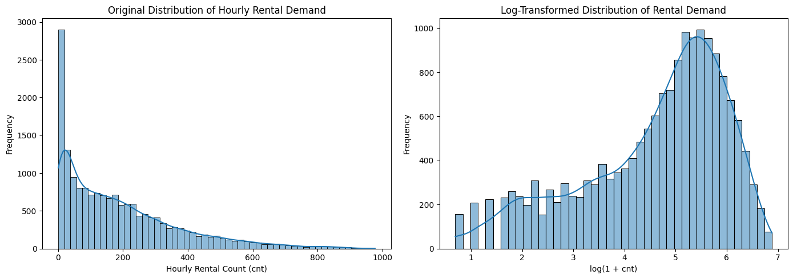
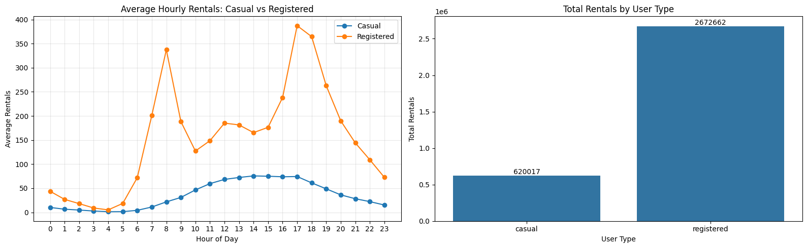
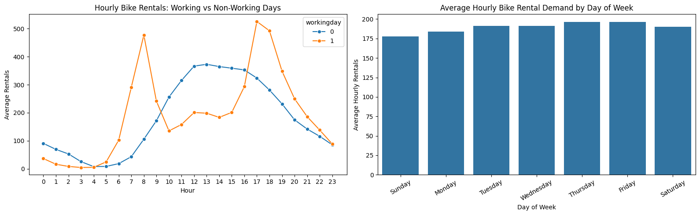
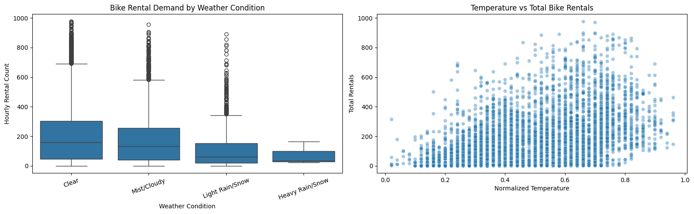
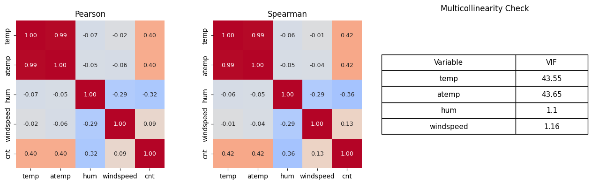
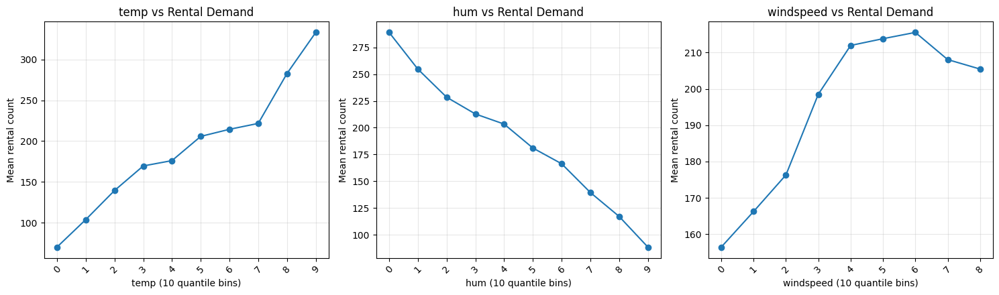
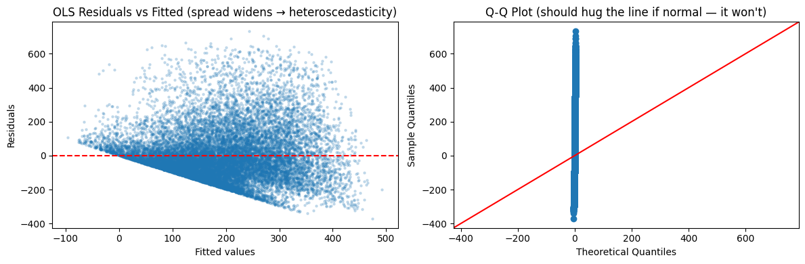
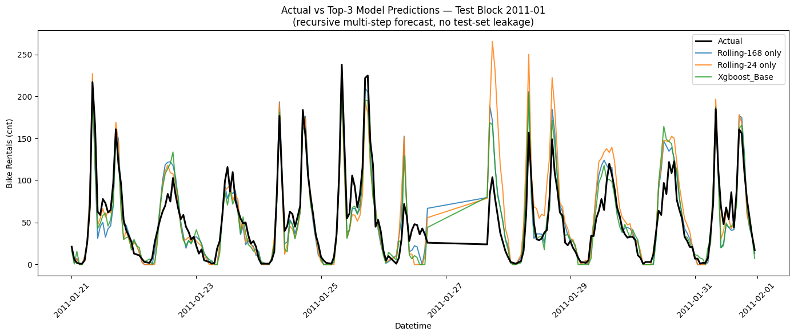

# Bike-Sharing Demand Analysis: Temporal, Weather, and User-Type Drivers in Washington, D.C.

*A statistical and machine-learning investigation of Capital Bikeshare hourly rental data (2011–2012)*

📄 [Full technical memorandum](reports/Bike_Sharing_Demand_Analysis_Memo.docx) · 📓 [Analysis notebook](notebooks/bike_sharing_analysis.ipynb)

---

## Abstract

Urban bike-sharing systems generate high-resolution behavioral data that make it possible to study how time, weather, and rider type jointly shape demand for shared mobility. This study analyzes 17,379 hourly rental records from Capital Bikeshare (Washington, D.C., January 2011 – December 2012) to (i) characterize the empirical structure of rental demand, (ii) identify and statistically validate its principal drivers, and (iii) build and evaluate a demand-forecasting pipeline under a realistic, leakage-controlled train/test regime. The analysis shows that hourly demand is a right-skewed, over-dispersed count process rather than a continuous Gaussian one, that registered and casual riders exhibit structurally different temporal signatures (commute-driven vs. leisure-driven), and that gradient-boosted trees substantially outperform a Negative Binomial regression baseline for forecasting (test RMSE 59.5 vs. 110.8; R² 0.89 vs. 0.63).

## Motivation & Research Questions

Bike-share operators face two related but distinct problems: understanding *why* demand fluctuates (for planning, pricing, and communication) and *predicting* how much demand to expect in a given hour (for rebalancing and capacity decisions). This project treats both as first-class questions rather than treating prediction as the only goal:

1. **RQ1 — Structure:** What is the shape of hourly rental demand, and does it depart from assumptions that a naive analysis (e.g., linear regression) would make?
2. **RQ2 — Drivers:** Which temporal and weather variables are statistically associated with demand, how strong are these associations, and what statistical issues (multicollinearity, non-linearity, distributional mismatch) does an analyst need to account for?
3. **RQ3 — Forecastability:** Under a train/test split that mimics an operational forecasting setting — predicting the last third of every month from the first two-thirds — how much of the variance in hourly demand can be recovered, and which features actually help?

## Dataset

The [UCI Bike Sharing Dataset](https://archive.ics.uci.edu/dataset/275/bike+sharing+dataset) provides hourly and daily rental logs from Capital Bikeshare. This study uses the hourly table (`hour.csv`): 17,379 observations, 17 fields, spanning 2011-01-01 to 2012-12-31, with **no missing values and no duplicate rows**. Weather covariates (`temp`, `atemp`, `hum`, `windspeed`) are min-max normalized to [0, 1] in the source data. Each row records the count of rentals initiated by casual (non-registered) and registered users in a given hour, along with calendar flags (season, holiday, working day, weekday, month, year) and weather conditions (situation code, temperature, feels-like temperature, humidity, wind speed). As a first integrity check, `casual + registered` was verified to equal `cnt` for all 17,379 rows, confirming the two rider segments are exhaustive and additive components of total demand.

## Working Process

The analysis was carried out as a single, linear notebook pipeline (`notebooks/bike_sharing_analysis.ipynb`), organized into three stages that mirror the research questions above:

**Stage 1 — Data audit and exploratory analysis.** After loading and type-casting the hourly and daily tables, the data was profiled for completeness, duplication, and range validity before any modeling assumption was made. Distributional shape, user-segment behavior, and temporal/weather patterns were then examined visually and numerically, in that order, so that later modeling choices (e.g., using a count-regression family rather than OLS) were motivated by evidence rather than assumed upfront.

**Stage 2 — Statistical and regression analysis.** Continuous predictors were screened for redundancy (Pearson/Spearman correlation, variance inflation factors) before being entered into a model, categorical predictors were tested with one-way ANOVA, and each continuous predictor's functional form was checked for non-linearity via decile-binned linear-vs-quadratic fits. Three regression specifications were then fit and compared on diagnostic grounds — OLS, Poisson GLM, and Negative Binomial GLM — to identify the model whose distributional assumptions actually match the data-generating process of hourly rental counts.

**Stage 3 — Forecasting under a realistic evaluation protocol.** Rather than a single chronological train/test cut, the assessment specified a **within-month** split: days 1–20 of every month for training, days 21 through month-end for testing, repeated across both years. This creates many short, interleaved train/test blocks rather than one long horizon, which makes it easy to accidentally leak information (e.g., a "yesterday's demand" feature computed carelessly could pull in test-period values from a different month's training block). To avoid this, lag and rolling-window features were computed from a copy of the target series with all test-period values masked to `NaN` *before* any shift or rolling operation, and test-set inference was performed with a **recursive multi-step forecast**: predictions for each test hour are generated in chronological order and fed back into the feature-construction step for subsequent hours, so that no model ever sees a real held-out target when building its own features. A statistical baseline (Negative Binomial GLM, refit on the training partition only) and seven XGBoost feature-set variants (no lags; 24-hour and 168-hour lags; 24-hour and 168-hour rolling means; and combinations) were then trained and compared on identical test data.

## Findings by Task

### Task 1 — Descriptive Statistics & Exploratory Analysis

**Observation 1 — Demand is a skewed count variable, not a bell-shaped continuous one.** Hourly rental count has mean 189.5, median 142, variance ≈ 32,901, and skewness 1.28. The raw distribution (Figure 1, left) shows a long right tail driven by a relatively small number of very high-demand hours — rush-hour commutes and pleasant-weather afternoons — sitting above a much larger mass of quiet overnight hours. A log(1+cnt) transform (Figure 1, right) visibly symmetrizes the distribution. This single observation has downstream consequences: it is the empirical motivation for treating `cnt` as a count outcome in Task 2 rather than modeling it with ordinary least squares.

<p align="center">
  
  <br><em>Figure 1. Hourly rental demand is right-skewed (left); a log transform brings it closer to symmetric (right).</em>
</p>

**Observation 2 — Registered and casual riders are behaviorally distinct populations, not scaled versions of each other.** Registered users account for 2,672,662 rentals (81.2% of total volume) against 620,017 (18.8%) for casual users, but the more interesting finding is *shape*, not just *share*. Figure 2 (left) shows registered rentals following a sharp bimodal profile with peaks at 08:00 and 17:00–18:00 — a commuting signature — while casual rentals rise gradually across the morning and peak broadly in the early-to-mid afternoon, consistent with leisure or tourist use. This is corroborated by the working-day breakdown: average casual rentals fall from 57.4/hour on non-working days to 25.6/hour on working days, while registered rentals rise from 124.0/hour to 167.6/hour — the two segments move in *opposite* directions as the day type changes, which is strong evidence that they are driven by different underlying activities rather than a common demand process scaled up or down.

<p align="center">
  
  <br><em>Figure 2. Average hourly rentals by user type (left) and total rental volume by user type (right).</em>
</p>

**Observation 3 — Temporal structure is hierarchical: hour-of-day dominates, day-of-week is comparatively weak.** Figure 3 (left) confirms the working-day vs. non-working-day divergence at the hourly level: working days show the commute double-peak, while non-working days show a single, broader midday hump. Figure 3 (right) shows average demand by weekday is comparatively flat — a pattern later confirmed statistically (Section: Task 2), where weekday's ANOVA F-statistic (3.49) is an order of magnitude smaller than hour-of-day's (759.09). The interpretation is that *which hour it is* matters far more to demand than *which day of the week it is* — the within-day rhythm dominates the across-week rhythm.

<p align="center">
  
  <br><em>Figure 3. Hourly demand by working-day status (left) and average demand by day of week (right).</em>
</p>

**Observation 4 — Demand responds monotonically, and asymmetrically, to weather.** Figure 4 (left) shows median rental count declining step-wise as weather conditions worsen (clear → mist/cloudy → light precipitation → heavy precipitation), with the heavy-rain/snow category both rare in the data and associated with visibly suppressed demand. Figure 4 (right) shows a broadly increasing but saturating relationship between normalized temperature and rentals — demand keeps climbing with temperature before leveling off at the highest values, foreshadowing the mild non-linearity quantified later in Task 2.

<p align="center">
  
  <br><em>Figure 4. Rental demand by weather condition (left) and against normalized temperature (right).</em>
</p>

### Task 2 — Statistical & Regression Analysis

**Observation 5 — `temp` and `atemp` are near-collinear and cannot both be used as independent predictors.** Figure 5 reports Pearson and Spearman correlation heatmaps alongside variance inflation factors for the continuous predictors. Both `temp` and `atemp` carry VIFs above 43 — far past the conventional concern threshold of 5–10 — because "feels-like" temperature is mechanically derived from actual temperature plus humidity and wind. Only `temp` was retained going forward; `hum` (VIF ≈ 1.1) and `windspeed` (VIF ≈ 1.16) show no meaningful collinearity and were both retained.

<p align="center">
  
  <br><em>Figure 5. Pearson (left) and Spearman (center) correlations, and VIF diagnostics (right).</em>
</p>

**Observation 6 — Every categorical factor tested is a statistically significant driver of demand, but effect sizes differ by an order of magnitude.** One-way ANOVA across hour, weekday, month, season, and weather situation returns F-statistics of 759.09, 3.49, 128.10, 409.18, and 127.17 respectively, all with p < 0.05 (weekday at p = 0.0019, all others effectively p ≈ 0). Statistical significance alone is not informative about magnitude here given the large sample size (n = 17,379); the F-statistics themselves are read as a rough importance ranking, and they reproduce the visual hierarchy already observed in Figures 2–4: hour dominates, season and month are strong, weather is moderate, weekday is comparatively marginal.

**Observation 7 — The temperature–demand and humidity–demand relationships are mostly monotone, with only mild curvature.** Binning each continuous predictor into deciles and comparing a linear to a quadratic OLS fit (Figure 6) shows that adding a quadratic term improves AIC for all three variables (temp: 226,976 → 226,975; hum: 228,172 → 228,152; windspeed: 229,934 → 229,875), with wind speed showing the largest *relative* R² gain (0.0087 → 0.0122) but temperature and humidity still explaining far more variance in absolute terms (R² ≈ 0.16 and 0.10 respectively vs. ≈ 0.01 for wind speed). The practical reading is that a linear specification is a reasonable first approximation for temperature and humidity, while wind speed's already-weak relationship is the one most likely to benefit from a non-linear model class.

<p align="center">
  
  <br><em>Figure 6. Mean rental count across decile bins of temperature, humidity, and wind speed, with linear vs. quadratic fit comparison.</em>
</p>

**Observation 8 — An OLS model is statistically misspecified for this outcome, and the residual diagnostics show exactly why.** An OLS specification (`cnt ~ temp + hum + windspeed + season + weathersit + workingday + holiday`) explains only R² = 0.283 of variance. More importantly, its residuals (Figure 7) fan out as fitted values increase — textbook heteroscedasticity — and depart visibly from the 45° reference line in the Q-Q plot, i.e., the residuals are not normally distributed. Both symptoms are expected consequences of forcing a non-negative, over-dispersed count variable into a homoscedastic-Gaussian-errors framework. A Poisson GLM was fit next as the natural count-regression alternative, but its deviance-to-degrees-of-freedom ratio of 117.17 (versus an expected value near 1 under the Poisson assumption) indicates severe overdispersion — the conditional variance of demand vastly exceeds its conditional mean, violating the Poisson model's core equidispersion assumption. A **Negative Binomial GLM**, which introduces a dispersion parameter to absorb this excess variance, was adopted as the preferred inferential model on these grounds.

<p align="center">
  
  <br><em>Figure 7. OLS residuals vs. fitted values (heteroscedasticity, left) and Q-Q plot (non-normality, right).</em>
</p>

**Observation 9 — Under the Negative Binomial model, temperature and humidity are the dominant drivers, and their effects are large in multiplicative terms.** Reading the NB-GLM's log-link coefficients as incidence rate ratios (IRR = e^coefficient): moving `temp` across its full observed range multiplies expected demand by roughly 14.6× holding all else fixed (coefficient 2.680, p < 0.001), while `hum` has a strongly negative effect (coefficient -1.525, IRR ≈ 0.22× — a one-unit increase in normalized humidity is associated with roughly a 78% reduction in expected demand, again holding other covariates fixed). Wind speed is positive but small (IRR ≈ 1.21×, p = 0.004). Seasonal effects show winter demand elevated relative to spring (IRR ≈ 1.47×) and fall depressed relative to spring (IRR ≈ 0.81×) — a pattern that is at first counterintuitive but is best read net of the `temp` covariate already in the model, i.e., a residual calendar effect after controlling for the measured temperature of the hour. The OLS and NB models agree on the sign and relative ranking of every driver, which is reassuring for the qualitative conclusions even though the NB model is preferred for any quantitative statement about demand.

### Task 3 — Demand Forecasting & Predictive Modeling

**Observation 10 — Switching from a statistical baseline to gradient-boosted trees roughly halves forecasting error.** Every XGBoost variant tested outperforms the Negative Binomial GLM baseline by a wide margin: the best XGBoost configuration achieves RMSE 59.52 against the NB-GLM's 110.80 (R² 0.892 vs. 0.626). Since both models have access to the same base feature set (hour, weekday, month, season, weather situation, temperature, humidity, wind speed, holiday, working-day, year), the gap is attributable to XGBoost's ability to model non-linear interactions — e.g., the effect of temperature on demand plausibly differs by hour-of-day and by season — that an additive GLM specification does not capture without manually engineered interaction terms.

**Observation 11 — Smoothed temporal features outperform single-point lags, but the marginal value of *any* temporal feature is smaller than expected.** Within the XGBoost family, the 168-hour (weekly) rolling mean is the single best feature addition (RMSE 59.52), narrowly ahead of the 24-hour rolling mean (59.80) and the no-lag base model (59.88) — but well ahead of the 168-hour point lag (69.05) and the 24-hour point lag (78.53). This ordering makes intuitive sense: a single lagged hour is noisy (it reflects one specific past hour's idiosyncratic conditions), while a rolling average smooths over a window and better represents the recent demand *regime*. The more striking observation, however, is how close the no-lag base model (RMSE 59.88) sits to the best rolling-feature model (RMSE 59.52) — a gap of well under 1%. This suggests that, under this particular multi-block train/test design, calendar and weather covariates alone already capture the large majority of predictable variance, and the leak-safe recursive construction of temporal features (necessary to avoid contaminating results with future information) adds only a modest further improvement rather than a transformative one.

<p align="center">
  
  <br><em>Figure 8. Actual vs. top-3 model predictions for a representative held-out test block, generated via the recursive multi-step, leak-safe forecasting procedure.</em>
</p>

Figure 8 plots the actual series against the top-3 models' recursive predictions for the first test block. All three tracked models follow the daily double-peak commute rhythm closely, with the largest visible deviations occurring around the highest demand spikes — consistent with the general tendency of tree-based regressors trained on squared-error-adjacent objectives to slightly under-predict extreme values, since large deviations are comparatively rare in the training distribution.

## Discussion & Limitations

The central empirical claim of this study — that hourly bike-share demand is a right-skewed, over-dispersed count process shaped hierarchically by hour-of-day, weather, and rider type — is supported consistently across the descriptive, inferential, and predictive stages of the analysis, which is a useful form of internal validation: the same variables identified as important in the ANOVA and NB-GLM stages (temperature, humidity, hour, season, weather situation) are the ones the forecasting model implicitly leans on for its strong no-lag performance. A few limitations are worth naming. First, the two-year window captures only one full seasonal cycle repeated twice, which limits how confidently the seasonal coefficients generalize beyond 2011–2012 system conditions. Second, the recursive forecasting procedure, while leak-safe, compounds its own prediction errors forward within a test block (an error in an early test hour can propagate into later lag/rolling features for that block); this is a deliberate and realistic trade-off for operational forecasting but means reported test errors are not directly comparable to a one-step-ahead evaluation. Third, weather variables in this dataset are contemporaneous with the rental hour, not a forecast — an operational deployment would need weather *forecasts* as inputs, which carry their own uncertainty not modeled here.

## Reproducing This Analysis

```bash
git clone https://github.com/<your-username>/bike-sharing-demand-analysis.git
cd bike-sharing-demand-analysis
pip install -r requirements.txt
jupyter notebook notebooks/bike_sharing_analysis.ipynb
```

The raw data (`hour.csv`, `day.csv`) is not redistributed in this repository — download it from the [UCI Machine Learning Repository](https://archive.ics.uci.edu/dataset/275/bike+sharing+dataset) and update the `DATA_PATH` variable at the top of the notebook to point to the folder containing it.

## Repository Structure

```
bike-sharing-demand-analysis/
├── notebooks/
│   └── bike_sharing_analysis.ipynb   # Full pipeline: EDA → regression → forecasting
├── reports/
│   └── Bike_Sharing_Demand_Analysis_Memo.docx   # Technical memorandum
├── images/                            # Figures referenced in this README
├── requirements.txt
├── LICENSE
└── README.md
```

## Tech Stack

`pandas`, `numpy` — data handling · `matplotlib`, `seaborn` — visualization · `scipy.stats` — ANOVA, Welch's t-test · `statsmodels` — OLS, Poisson & Negative Binomial GLM, VIF · `scikit-learn` — evaluation metrics · `xgboost` — gradient-boosted forecasting models

## License

Released under the [MIT License](LICENSE).
